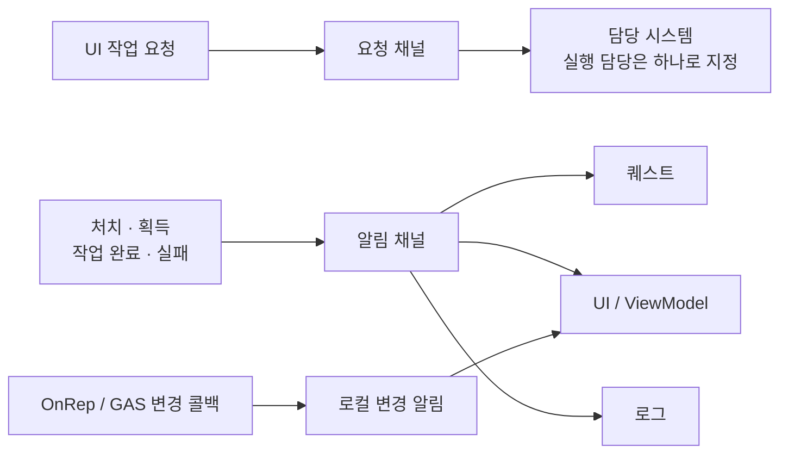
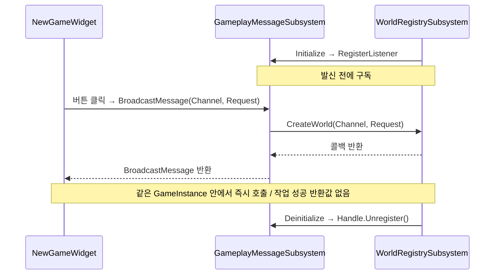
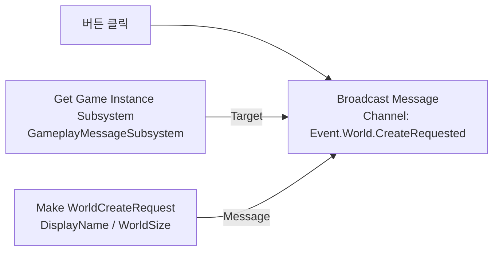
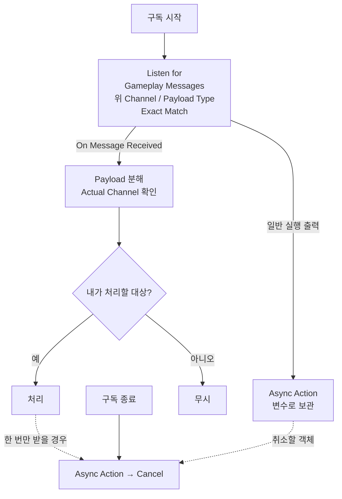
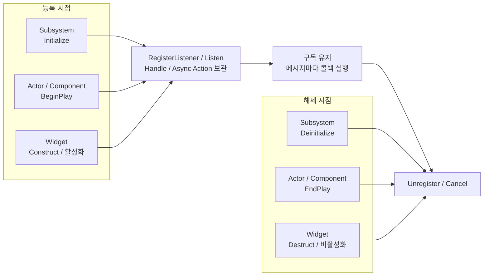
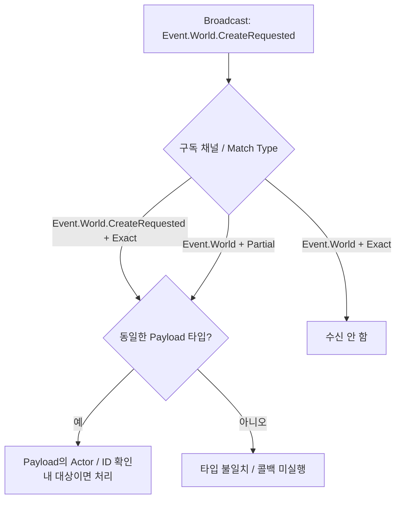
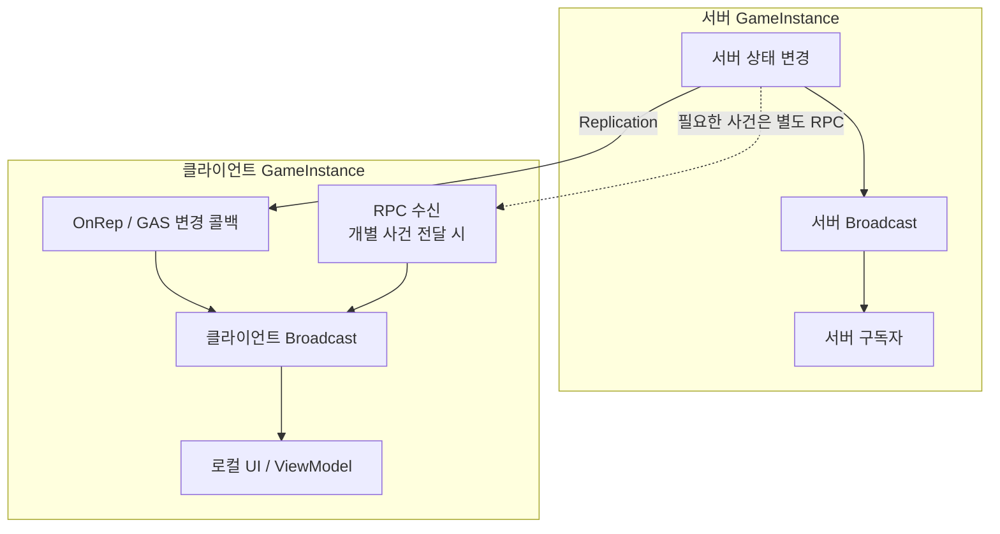
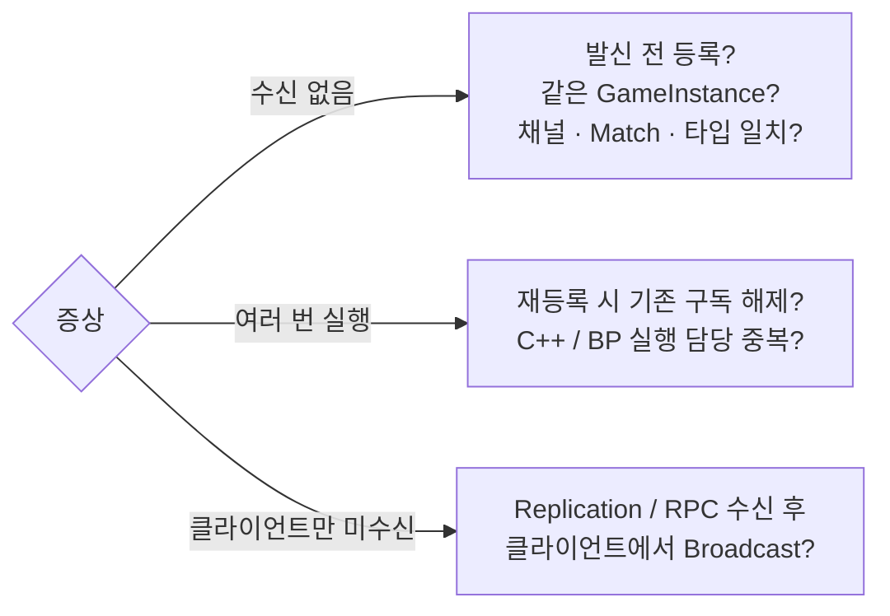

# Runtime Message System 사용 가이드 (초안)

`GameplayMessageRouter` · `UGameplayMessageSubsystem` · **채널당 하나의 Payload 타입**

## 1. 어디에 사용하는가



현재 값 조회·반환값이 필요한 호출은 **함수 / 인터페이스**, 이미 참조 중인 특정 객체의 알림은 **Delegate**를 사용한다.

## 2. 현재 프로젝트 연결

**채널:** `Event.World.CreateRequested` · **Payload:** `FWorldCreateRequest { DisplayName, WorldSize }`



`CreateWorld()`의 생성 처리는 구현 중이다. **요청 수신 ≠ 생성 완료.**

<details>
<summary>C++ 최소 예제 펼치기</summary>

공통 include: `GameFramework/GameplayMessageSubsystem.h`, `AbilitySystem/FallenEraGameplayTags.h`, `WorldGenerator/Data/Payload.h`. 현재 모듈에는 `GameplayMessageRuntime` 의존성이 등록되어 있다.

```cpp
// 수신자 멤버
FGameplayMessageListenerHandle WorldCreateRequestHandle;
void CreateWorld(FGameplayTag Channel, const FWorldCreateRequest& Request);

// UWorldRegistrySubsystem::Initialize 내부, Super 호출 후
auto* Router = Collection.InitializeDependency<UGameplayMessageSubsystem>();
WorldCreateRequestHandle = Router->RegisterListener<FWorldCreateRequest>(
    FallenEraGameplayTags::TAG_Event_World_CreateRequested,
    this, &ThisClass::CreateWorld);

// 발신 객체의 멤버 함수 내부
FWorldCreateRequest Request;
Request.DisplayName = TEXT("New World");
Request.WorldSize = FIntPoint(1024, 1024);
UGameplayMessageSubsystem::Get(this).BroadcastMessage(
    FallenEraGameplayTags::TAG_Event_World_CreateRequested, Request);

// UWorldRegistrySubsystem::Deinitialize 내부, Super 호출 전
WorldCreateRequestHandle.Unregister();
```

원본: [발신](../Source/FallenEra/WorldGenerator/WorldSystemWidget/NewGameWidget.cpp) · [수신](../Source/FallenEra/WorldGenerator/WorldRegistrySubsystem.cpp) · [Payload](../Source/FallenEra/WorldGenerator/Data/Payload.h) · [채널](../Source/FallenEra/AbilitySystem/FallenEraGameplayTags.cpp)

</details>

## 3. Blueprint 연결

같은 **Channel + Payload 타입**이면 C++ ↔ BP도 연결된다. 아래는 위 월드 생성 요청의 BP 표현이다.





**기존 C++ 수신자와 BP 수신자는 둘 다 호출된다.** 월드 생성 실행을 중복 연결하지 않는다.

## 4. 구독 수명



**재등록 전 기존 구독 해제.** Handle 변수 소멸만으로는 해제되지 않는다. 늦게 구독한 화면의 초기값은 원본 시스템에서 조회한다.

## 5. 채널 선택과 수신 조건



**Exact가 기본. Partial은 자신 + 하위 채널.** 필드가 같아도 다른 구조체는 다른 타입이다. 여러 요청의 결과를 구분해야 하면 요청·결과에 같은 Request ID를 넣는다.

<details>
<summary>C++에서 Partial Match 지정</summary>

기존 구독을 해제한 뒤 아래 방식으로 등록한다. 해당 하위 채널은 모두 같은 Payload 타입을 사용해야 한다.

```cpp
FGameplayMessageListenerParams<FWorldCreateRequest> Params;
Params.MatchType = EGameplayMessageMatch::PartialMatch;
Params.SetMessageReceivedCallback(this, &ThisClass::CreateWorld);
WorldCreateRequestHandle = UGameplayMessageSubsystem::Get(this)
    .RegisterListener<FWorldCreateRequest>(
        FallenEraGameplayTags::TAG_Event_World_CreateRequested, Params);
```

</details>

## 6. 멀티플레이 전달 범위



**메시지 자체는 네트워크로 전달되지 않는다.** Listen Server 호스트 UI도 로컬 발신 경로가 필요하며, 같은 변경은 한 번만 알린다.

## 7. 동작과 문제 확인

| 동작 | 적용 |
| --- | --- |
| 즉시 콜백 · 호출 순서 보장 없음 | 무거운 작업·수신자 간 실행 순서 의존 분리 |
| 과거 메시지 저장 없음 | 구독 전 사건은 재수신 불가 |
| Payload 참조는 콜백 동안 사용 | 지연 처리할 값은 수신 시 복사 |



발신 로그: `GameplayMessageSubsystem.LogMessages 1` · 끄기: `0` · 로그가 있어도 수신 성공을 뜻하지는 않는다.

구현: [라우터](../Plugins/GameplayMessageRouter/Source/GameplayMessageRuntime/Public/GameFramework/GameplayMessageSubsystem.h) · [BP 수신 Action](../Plugins/GameplayMessageRouter/Source/GameplayMessageRuntime/Private/GameFramework/AsyncAction_ListenForGameplayMessage.cpp) · 포맷: [GitHub Mermaid](https://docs.github.com/en/get-started/writing-on-github/working-with-advanced-formatting/creating-diagrams)
